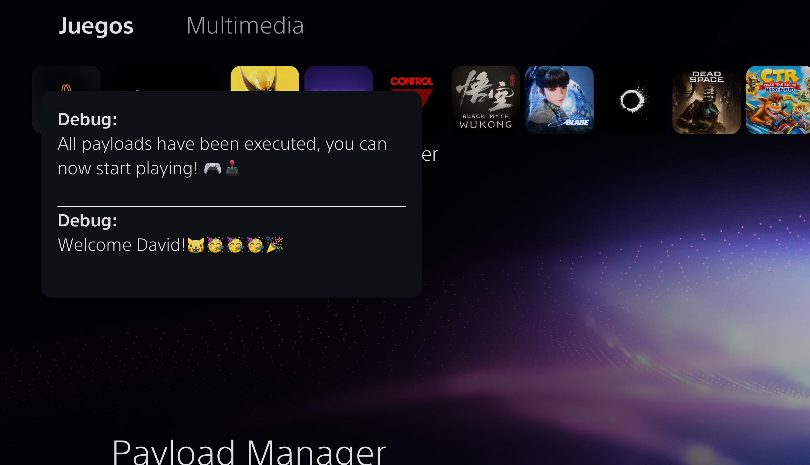
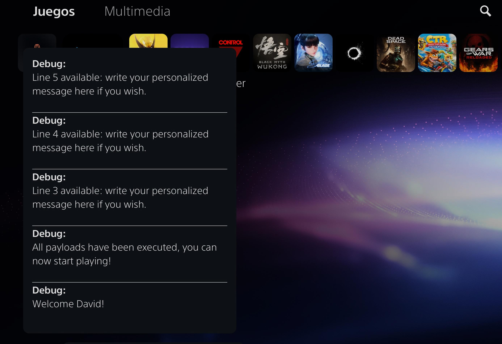

# ps5-custom-notifications

A lightweight C-based payload for PlayStation 5 consoles that reads a local `message.txt` file and displays its lines as native system notifications.

<p align="center">
  
  <br>
  <em>Two-line demonstration</em>
</p>

## 🚀 Features

* **Smart Search Hierarchy:** Scans external USB ports (`usb0` through `usb7`) first, stopping at the first found `message.txt`. If none are found, it falls back to internal storage (`/data/ps5_autoloader/message.txt`).
* **Clean Formatting \& Limits:** Automatically omits blank lines, displays up to a maximum of 5 lines, and truncates lines exceeding 80 characters with an ellipsis (`...`).
* **Multilingual Error Handling:** Fully supports 31 PS5 system languages for error notifications if the file cannot be located.
* **Silent Execution:** No progress or search notifications are shown before displaying the actual message lines.

## ⚠️ Limitations

To ensure system stability and a smooth user experience within the PS5 notification daemon, the payload enforces the following rules:

* **Max 5 Lines:** Only the first 5 non-empty lines of the `message.txt` file are processed and displayed as individual pop-up notifications. Any subsequent lines are ignored.
* **Max 90 Characters per Line:** Lines longer than 90 characters are automatically truncated at 86 characters and appended with `...` to prevent UI overflow or notification formatting glitches.

<p align="center">
  
  <br>
  <em>Five-line demonstration</em>
</p>

## 🛠️ Build Requirements

* PS5 Payload SDK
* `prospero-clang` toolchain in a Linux environment (Ubuntu / WSL)

To build the project, run:

```bash
make clean && make
```

## 📖 Instructions for Use

1. **Prepare your message file:**
* Create a text file named `message.txt` containing the lines you want to display.
* Place it either in `/data/ps5_autoloader/` on the console's internal storage, or inside a `ps5_autoloader` folder on the root of an exFAT/FAT32 USB drive.

2. **Run the Payload:**
* Inject or launch `ps5_notify.elf` on your PS5 using your preferred payload loader.

## 🤖 Credits

* Developed with the assistance of **Google Gemini** and **ChatGPT**.
* Based on foundational tools and payload structures by John Törnblom.
* Thanks to **Drakmor** and the **ShadowMountPlus** project for providing a reference for the PS5 system language
detection implementation used in this project.

